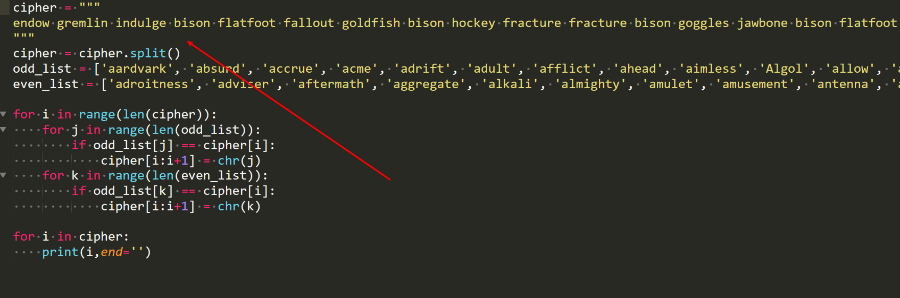
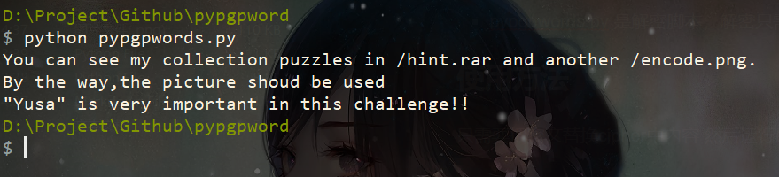

## 介绍

PGP词汇表（即“良好隐私密码法词汇表”，又称生物识别词汇表（Biometric list）），是一个通过声音频道传输字节时使用的词汇表，目的是清晰表达内容。
1995年由计算机语言学家帕特里克·尤奥拉和PGP的创造者菲尔·齐默尔曼发明。PGP词汇表与飞行员使用的北约音标字母类似，但此表中的每一个词的值都与256个字节数值一一对应。

2020西湖论剑yusapapa遇到这个东西，发现GitHub上没有py解密脚本，遂写了一个

## 文件介绍
* words.txt 里面是字典
* list_gen.py 用words.txt生成python列表
* pypgpwords.py 是解密脚本，解密只需用到这个

## 使用方法

只需要把密文替换cipher中内容 然后运行即可

GitHub上图片

外链

